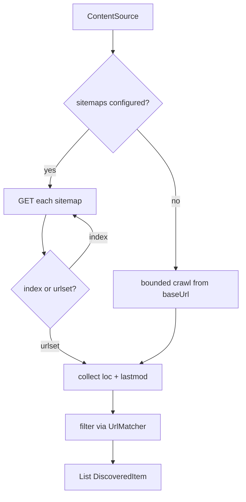

# Design: Sitemap Crawler

## Summary

`SitemapCrawler` discovers the candidate URLs of a `website` source by reading its sitemap
index and child sitemaps via Spring's `RestClient`, collecting every `<loc>` with its
`<lastmod>`, and filtering the result against the source's Ant-glob `urlInclude`/`urlExclude`
(spec 002). When a source has no sitemap, it falls back to a bounded link-following crawl
from `baseUrl`. Output is a list of discovered items (URL + change marker) for the fetch stage.

## GitHub Issue

— (roadmap Phase 1 step 4; design doc §5.1, §6)

## Goals

- Read sitemap index + nested child sitemaps → all `<loc>` + optional `<lastmod>`.
- Filter candidates via `UrlMatcher` (spec 002).
- Produce `DiscoveredItem(url, lastmod)` records.
- Bounded fallback crawl from `baseUrl` when `sitemaps` is empty.

## Non-goals

- No page-body fetching/extraction (specs 005/006).
- No diffing against the index (spec 008).
- No robots.txt enforcement yet (spec 014) — but structure the fetch so it can be added.

## Technical approach

### `DiscoveredItem` (record)

```java
public record DiscoveredItem(String url, String lastmod) {}   // lastmod may be null
```

(Shared with the git strategy in spec 016; consider placing in the source-strategy package.)

### `SitemapCrawler`

Uses `RestClient` (house pattern: build with `RestClient.builder().baseUrl(...).build()` or
inject the shared client; see `DbBackupClient`/`WebhookSender`). For each configured sitemap
path:

1. GET the sitemap XML.
2. If it is a **sitemap index** (`<sitemapindex>`), recurse into each `<sitemap><loc>` child.
3. If it is a **urlset** (`<urlset>`), collect each `<url><loc>` + `<lastmod>`.
4. Parse XML with jsoup (already a dependency, XML parser mode) or `DocumentBuilder`. Prefer
   jsoup in XML mode for consistency with `ContentExtractor` (spec 006).
5. Filter every collected `<loc>` path through `UrlMatcher.matches(source, path)`.

```java
@Component
public class SitemapCrawler {
    List<DiscoveredItem> discover(ContentSource src);   // reads src.sitemaps(), filters by urlInclude/exclude
}
```

### No-sitemap fallback

When `src.sitemaps()` is empty: start at `baseUrl`, GET the page, extract internal `<a href>`
links within the same host, keep those matching `urlInclude`, and follow them with a
**bounded depth** and a visited-set to avoid loops. Depth bound is a small constant (e.g. 3)
or a configurable limit. This keeps the crawl finite for sites without sitemaps.

### Rationale

- **Sitemap-first** is cheap, precise, and gives `<lastmod>` for the incremental diff (spec 008).
- **jsoup XML mode** avoids adding a second XML library and matches the extractor stack.
- **Bounded fallback** so a missing sitemap (open question for hiero.org, design §"Open questions") does not block P2.

## Key flows



## Dependencies

- `RestClient` (Spring, on classpath).
- `UrlMatcher` / `ContentSource` (spec 002).
- jsoup for XML parsing (dependency from spec 001).

## Open questions

- Does `hiero.org` expose a sitemap with `/blog/` entries, or is the fallback crawl needed? (design §"Open questions"; resolve in spec 015.)
- Fallback crawl depth/politeness bound — make configurable vs. fixed constant.
