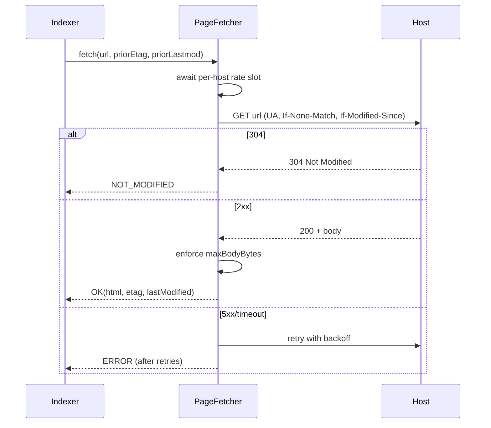

# Design: Page Fetcher

## Summary

`PageFetcher` performs robust, polite HTTP GETs of discovered pages via `RestClient`. It sends
the configured bot `User-Agent`, supports conditional requests (`If-Modified-Since` / `ETag`)
so unchanged pages return `304 Not Modified`, enforces a timeout and a maximum body size, rate-limits
per host, and retries transient failures with backoff. Output is the raw HTML plus response
metadata for the extractor.

## GitHub Issue

— (roadmap Phase 1 step 5; design doc §5.3, §10)

## Goals

- GET a URL with UA `OpenElementsContentBot/1.0 (+https://open-elements.com)` (from `ContentSourceProperties`).
- Conditional GET: send `If-Modified-Since`/`If-None-Match` when a prior `lastmod`/`ETag` is known; treat `304` as "unchanged".
- Timeout (`requestTimeout`) and body-size cap (`maxBodyBytes`).
- Per-host rate limit (≤ `rateLimitPerHost` req/s, default 2).
- Retry transient errors (5xx, timeouts) with exponential backoff; do not retry 4xx.

## Non-goals

- No HTML parsing/extraction (spec 006).
- No robots.txt (spec 014).
- No sitemap discovery (spec 004).

## Technical approach

### `FetchResult` (record)

```java
public record FetchResult(
    Status status,        // OK | NOT_MODIFIED | NOT_FOUND | ERROR
    String html,          // null unless OK
    String etag,          // response ETag, if any
    String lastModified,  // response Last-Modified, if any
    int httpStatus
) {}
public enum Status { OK, NOT_MODIFIED, NOT_FOUND, ERROR }
```

### `PageFetcher`

```java
@Component
public class PageFetcher {
    FetchResult fetch(String url, String priorEtag, String priorLastmod);
}
```

- Build a `RestClient` with `requestTimeout` and the bot `User-Agent` as a default header.
- Use `.get().uri(url).header("If-Modified-Since", …).header("If-None-Match", priorEtag).exchange((req, res) -> …)` (house pattern from `DbBackupClient`) to inspect status without throwing.
- `304` → `Status.NOT_MODIFIED` (no body). `2xx` → read body, enforce `maxBodyBytes` (truncate/abort if exceeded). `404`/`410` → `NOT_FOUND` (signals deletion to spec 008). `5xx`/timeout → retry, then `ERROR`.
- **Rate limiting:** a per-host limiter (token bucket / `RateLimiter`-style, or a simple timestamp gate keyed by host) enforces the min interval between requests to the same host.
- **Retry/backoff:** small bounded retry (e.g. 3 attempts) with exponential backoff on transient failures; wrap with a helper rather than a new dependency.

### Rationale

- **Conditional GET + 304** minimizes bandwidth and pairs with the `lastmod` diff (spec 008) for cheap incremental refresh.
- **Per-host rate limit** keeps crawling polite (design §5.3) and shared across sources on the same host (OE serves both EN and DE).
- **`.exchange` callback** so non-2xx statuses are handled as data, not exceptions (matches `DbBackupClient`).
- **`NOT_FOUND` as a first-class status** so the indexer can delete vanished pages (spec 008).

## Key flows



## Dependencies

- `RestClient` (Spring).
- `ContentSourceProperties` (spec 002) for UA, timeout, rate limit, max body size.

## Open questions

- Rate limiter implementation: hand-rolled per-host gate vs. a small library (Resilience4j/Guava `RateLimiter`). Prefer no new dependency unless the parent already provides one.
- Body-size enforcement: streaming abort vs. read-then-check. Streaming abort is safer for very large pages; confirm what `RestClient` allows.
