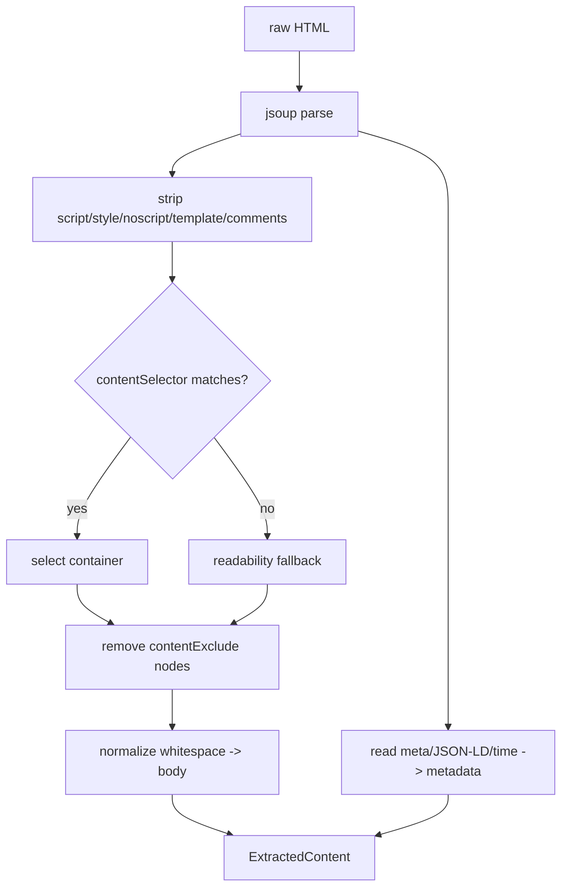

# Design: Content Extractor

## Summary

`ContentExtractor` turns raw HTML (from `PageFetcher`) into a clean `ContentDocument` body and
its metadata using **jsoup**. It selects the main content container via the source's
`contentSelector`, always strips non-content nodes (`script`/`style`/`noscript`/`template`/comments),
removes any `contentExclude` elements, and whitespace-normalizes the remaining text. Metadata
(title, date, author, categories, excerpt, preview image) is read independently from
structured sources (`<meta>` OpenGraph/Article, JSON-LD, `<time datetime>`).

## GitHub Issue

— (roadmap Phase 1 step 6; design doc §5.4, §6 `content-selector`/`content-exclude`/metadata)

## Goals

- Select main content via `contentSelector` (comma-separated fallback list, first match wins); `body` = whole document.
- Always remove `script`, `style`, `noscript`, `template`, and HTML comments — even for `body`.
- Remove all `contentExclude` selector matches before text extraction.
- Whitespace-normalize the extracted text into a clean `body` string.
- Readability-style fallback (largest contiguous text block) when no selector matches.
- Extract metadata independently of `contentSelector` from `<meta>`/JSON-LD/`<time>`.

## Non-goals

- No fetching (spec 005) or discovery (spec 004).
- No indexing/mapping to Meilisearch (spec 008).
- HTML→Markdown conversion is optional and out of scope unless trivially available (design §9 notes `flexmark-html2md-converter` as an option). Default: cleaned plaintext body.

## Technical approach

### API

```java
@Component
public class ContentExtractor {
    ExtractedContent extract(ContentSource src, String url, String html);
}
public record ExtractedContent(
    String title, String excerpt, String body, String author,
    List<String> categories, String publishedDate, String previewImage, String locale
) {}
```

`ContentIndexer` (spec 008) maps `ExtractedContent` + `url`/`source` into a `ContentDocument`.

### Body extraction

1. `Jsoup.parse(html, url)`.
2. Always remove `script, style, noscript, template` elements and comment nodes.
3. Select container: try each selector in the comma-separated `contentSelector` in order; first non-empty match wins. `body` selects the whole `<body>`. If none configured or none match → **readability fallback** (largest text-density block).
4. Remove all `contentExclude` selector matches from the chosen container.
5. Extract text, normalizing whitespace (collapse runs, trim, preserve paragraph breaks).

### Metadata extraction (independent of `contentSelector`)

- **title**: `<meta property="og:title">` → `<title>` → first `<h1>`.
- **excerpt**: `<meta name="description">` / `og:description`.
- **publishedDate**: `<meta property="article:published_time">` → JSON-LD `datePublished` → `<time datetime>`.
- **author**: `<meta name="author">` / `article:author` → JSON-LD `author.name`.
- **categories**: `<meta property="article:tag">` (multiple) / JSON-LD `keywords`.
- **previewImage**: `<meta property="og:image">`.
- **locale**: from the source's locale-derivation rule (path prefix, e.g. `/de/…` → `de`), with `og:locale`/`<html lang>` as a supplement.

For our own Next.js site the markup is known and robust; for external sites these structured
sources are the most stable, with graceful degradation when a field is absent.

### Rationale

- **jsoup** — the one new parsing dependency (design §9); handles messy real-world HTML.
- **Selector-first with readability fallback** — explicit selectors are stable for known sites; the fallback keeps unknown/external pages usable (design §6).
- **Structured metadata first** — `<meta>`/JSON-LD are far more reliable than scraping visible text.
- **Always-strip list** guarantees no scripts/styles leak into the search index even when `content-selector: body`.

## Key flows



## Dependencies

- jsoup (spec 001).
- `ContentSource` (spec 002) for `contentSelector`, `contentExclude`, locale rule.

## Open questions

- Markdown vs. plaintext body: keep plaintext now; add `flexmark-html2md-converter` only if downstream consumers need Markdown structure (design §9).
- Excerpt fallback when no `description` meta exists (first N chars of body?) — decide during implementation.
