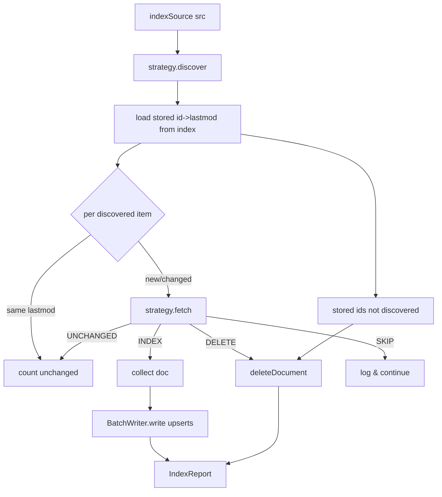

# Design: Content Indexer

## Summary

`ContentIndexer` orchestrates the full ingestion pipeline for one source through the
`ContentSourceStrategy` seam (spec 007): **Discover → Diff → Fetch → Extract → Index**. It
diffs discovered `lastmod` values against what is already stored in the Meilisearch index so
only new/changed pages are fetched, upserts documents via the library `BatchWriter`, and
deletes documents whose URLs disappeared. It is the reusable engine that both the bootstrap
step (spec 009) and the refresh scheduler (spec 010) call.

## GitHub Issue

— (roadmap Phase 1 step 8; design doc §5.2, §5.5, §11)

## Goals

- Drive Discover → Diff → Fetch → Extract → Index for a given `ContentSource` via its strategy.
- Diff by change-marker (`lastmod`/ETag) against stored index state → fetch only new/changed URLs.
- Upsert via `BatchWriter.write(client, indexUid, stream, batchSize, taskWait)`.
- Delete documents whose URLs are gone from discovery (sitemap diff / 404).
- Idempotent by stable `id`; fault-tolerant (one bad page skips only that document).

## Non-goals

- No startup wiring (spec 009) or scheduling (spec 010) — this is the callable engine only.
- No query/search (spec 011).

## Technical approach

### API

```java
@Component
public class ContentIndexer {
    IndexReport indexSource(ContentSource src);       // full pass over one source
    Stream<Map<String,Object>> streamAllDocuments(ContentSource src);  // for bootstrap (spec 009)
}
public record IndexReport(int discovered, int upserted, int unchanged, int deleted, int skipped) {}
```

### Diff strategy

The stored change-marker per document is the `lastmod` field already in the index (spec 003).
To diff without a separate datastore:

1. `strategy.discover(src)` → `List<DiscoveredItem>` (URL + `lastmod`).
2. Load the current `{id → lastmod}` map for this source from Meilisearch (a filtered query on
   `source` returning `id`,`url`,`lastmod`; paged). This is the "stored state".
3. For each discovered item compute `id = ContentDocument.id(source, url)`:
   - **new** (id not in stored) or **changed** (`lastmod` differs / missing) → fetch.
   - **same `lastmod`** → count `unchanged`, skip fetch.
4. **Deletions:** stored ids whose URL is not in the current discovery set → `deleteDocument`.

For website sources the strategy's `fetch` also does a conditional GET (spec 005), so even a
"changed by lastmod" page can come back `UNCHANGED` (304) — both diff layers cooperate.

### Indexing

- Map `FetchOutcome.INDEX` documents to `Map` via `ContentDocument.toMap()`.
- Push with `BatchWriter.write(meilisearchClient, indexUid, docStream, BATCH_SIZE, TASK_WAIT)` — the library batches, waits for each task, logs failures, and continues.
- `FetchOutcome.DELETE` and diff-detected deletions → `MeilisearchClient.deleteDocument(indexUid, id)`.
- `indexUid = MeilisearchProperties.resolveIndex("content")` (same as spec 003).

### Fault tolerance & idempotency (design §11)

- A single failing page → `SKIP`, logged, pipeline continues.
- Upsert keyed by stable `id` → re-running is safe (idempotent).
- Deletions derived from the discovery diff, not guessed.

### Rationale

- **Reading stored `lastmod` from the index** avoids introducing a separate state DB — the index *is* the state (design §5.2).
- **`BatchWriter`** is the house mechanism for bulk writes with task-waiting and partial-failure tolerance (design §2/§11).
- **Two-layer diff** (`lastmod` + conditional GET) minimizes fetches and bandwidth.

## Key flows



## Dependencies

- `SourceStrategyRegistry`/`ContentSourceStrategy` (007), `ContentDocument` (003), `MeilisearchClient` + `BatchWriter` + `MeilisearchProperties` (spring-services), `ContentSourceProperties` (002).

## Open questions

- Reading stored `{id → lastmod}`: via `multiSearch` with a `source` filter + `attributesToRetrieve`, paged, or via a Meilisearch documents-scan endpoint. Choose the cheapest reliable option at implementation time.
- `BATCH_SIZE`/`TASK_WAIT` values — reuse the library defaults (500 / 10s) unless content batches warrant tuning.
