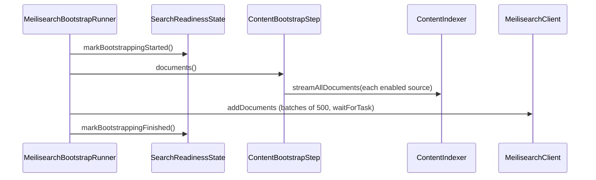

# Design: Content Bootstrap Step

## Summary

Register a `ContentBootstrapStep` implementing the library's `SearchIndexBootstrapStep` so the
content index is fully populated at application startup. The library's
`MeilisearchBootstrapRunner` discovers the step, streams its documents into Meilisearch in
batches, and flips `SearchReadinessState` from "bootstrapping" to "ready" when done — the step
itself only declares the target index and provides a lazy document stream.

## GitHub Issue

— (roadmap Phase 1 step 9; design doc §5.6, §11)

## Goals

- Implement `SearchIndexBootstrapStep` for the content index: `indexUid()` + `documents()`.
- Source the documents from `ContentIndexer.streamAllDocuments(...)` across all enabled sources.
- Rely on the library runner for batching, task-waiting, and readiness signaling.

## Non-goals

- No incremental refresh (spec 010).
- No manual batching or readiness management — the library `MeilisearchBootstrapRunner` owns both.

## Technical approach

`SearchIndexBootstrapStep` (library interface) has exactly two methods:

```java
@Component
public class ContentBootstrapStep implements SearchIndexBootstrapStep {
    private final ContentSourceProperties props;
    private final ContentIndexer indexer;
    private final MeilisearchProperties meili;

    @Override public String indexUid() { return meili.resolveIndex("content"); }

    @Override public Stream<Map<String,Object>> documents() {
        return props.sources().stream()
            .filter(ContentSource::enabled)
            .flatMap(indexer::streamAllDocuments);   // lazy; runner batches & closes
    }
}
```

The library's `MeilisearchBootstrapRunner` (`@Order(30)`, runs after
`MeilisearchIndexSettingsInitializer`) will:
- call `markBootstrappingStarted()` on `SearchReadinessState`,
- consume `documents()` in batches of `BATCH_SIZE` (500), pushing via `MeilisearchClient.addDocuments` and waiting per task,
- run inside the `searchIndexExecutor` pool **if** the app provides `@EnableAsync` + that executor bean; otherwise synchronously at startup,
- call `markBootstrappingFinished()` when complete,
- wrap the step in try/catch so a failure in one step does not stop others.

### Sync vs. async decision (from spec 001 open question)

For a modest content index, **synchronous bootstrap at startup is acceptable** and simplest —
do not add `@EnableAsync`/`searchIndexExecutor` unless startup latency becomes a problem. If
async is desired later, add `@EnableAsync` and a `searchIndexExecutor` `ThreadPoolTaskExecutor`
bean; no change to `ContentBootstrapStep` is needed.

### Rationale

- **Thin step, fat runner** — matches the library contract; readiness/batching are solved centrally, so the step is just "which index" + "what documents".
- **Lazy stream** — the runner batches and closes it (try-with-resources), so memory stays bounded even for many pages.
- **Reuse `ContentIndexer`** — the same engine that the scheduler uses (spec 010), so bootstrap and refresh cannot diverge.

## Key flows



## Dependencies

- `SearchIndexBootstrapStep`, `MeilisearchBootstrapRunner`, `SearchReadinessState`, `MeilisearchProperties` (spring-services).
- `ContentIndexer` (008), `ContentSourceProperties` (002).

## Open questions

- Whether bootstrap should always do a full reindex (library default) or honor the incremental diff. Library semantics = full reindex on every startup; acceptable for content. Keep default.
- If startup time grows, switch to async (`@EnableAsync` + `searchIndexExecutor`) — track as a follow-up.
