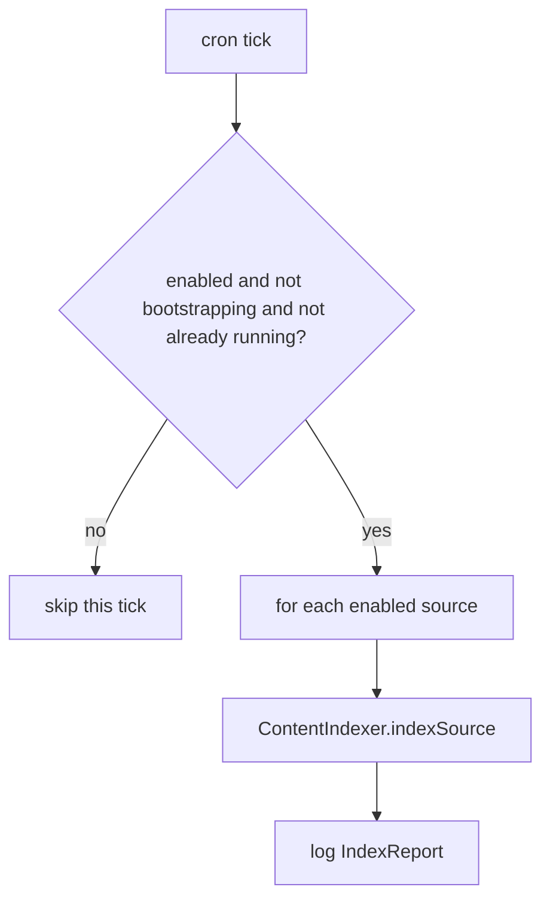

# Design: Content Refresh Scheduler

## Summary

`ContentRefreshScheduler` periodically re-runs the incremental ingestion over all enabled
sources using the same `ContentIndexer` engine (spec 008). It is a `@Scheduled` bean driven by
the configurable `refresh-cron` (default hourly), so new/changed pages are picked up and
vanished pages removed without a restart. It relies entirely on the indexer's `lastmod`/304 diff
so a refresh that finds no changes is cheap.

## GitHub Issue

— (roadmap Phase 1 step 10; design doc §5.6, §6)

## Goals

- A `@Scheduled(cron = "${open-elements.content.refresh-cron}")` method that calls `ContentIndexer.indexSource(...)` for each enabled source.
- Non-overlapping runs (a slow refresh must not stack on the next tick).
- Respect a global `enabled` flag and skip when Meilisearch is still bootstrapping.
- Aggregate and log an `IndexReport` per source.

## Non-goals

- No initial full reindex (spec 009 handles startup).
- No change to the ingestion logic itself (reuses spec 008).

## Technical approach

```java
@Component
public class ContentRefreshScheduler {
    private final ContentSourceProperties props;
    private final ContentIndexer indexer;
    private final SearchReadinessState readiness;

    @Scheduled(cron = "${open-elements.content.refresh-cron:0 0 * * * *}")
    void refresh() {
        if (!props.enabled() || readiness.isBootstrapping()) return;
        for (ContentSource src : props.sources()) {
            if (!src.enabled()) continue;
            IndexReport report = indexer.indexSource(src);
            log.info("refresh source={} {}", src.id(), report);
        }
    }
}
```

- `@EnableScheduling` is already on `ContentMcpApplication` (spec 001).
- **Non-overlap:** guard with a re-entrancy flag (`AtomicBoolean running`) or configure a single-threaded scheduler; a long-running refresh skips the next tick rather than overlapping.
- **Bootstrap guard:** skip while `SearchReadinessState.isBootstrapping()` to avoid competing with the startup reindex.
- Cron is externalized so ops can change cadence without a rebuild.

### Rationale

- **Reuse `ContentIndexer`** so scheduled refresh and startup bootstrap share identical semantics (diff, upsert, delete, fault tolerance).
- **Cron over fixed-delay** — matches design §6 `refresh-cron` and gives ops precise control (e.g. off-peak).
- **Skip-if-bootstrapping / skip-if-disabled** — safe, predictable behavior in degraded states.

## Key flows



## Dependencies

- `ContentIndexer` (008), `ContentSourceProperties` (002), `SearchReadinessState` (spring-services), Spring scheduling (`@EnableScheduling`, spec 001).

## Open questions

- Per-source cron vs. one global cron. Start global (design §6). Revisit if sources need different cadences.
- Whether to expose a manual "refresh now" trigger (e.g. an MCP admin tool or actuator endpoint). Out of scope; capture as TODO if wanted.
