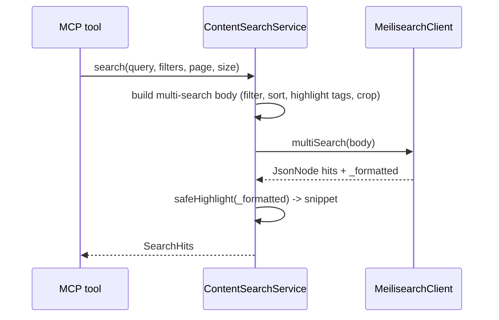

# Design: Content Search Service

## Summary

`ContentSearchService` is the facade the MCP tools (spec 012) call. It builds Meilisearch
`multi-search` request bodies with filters (`source`, `locale`, `categories`, date range),
applies the `title > excerpt > body` searchable weighting and a `publishedDate:desc`
tie-breaker, and turns raw hits into safe, highlighted results using the library `Highlighter`.
It also exposes list, get-by-id/url, and category-facet operations backing the four tools.

## GitHub Issue

— (roadmap Phase 1 step 11; design doc §7, §8)

## Goals

- `search(query, filters, page, size)` → hits with title, url, publishedDate, highlighted snippet, score.
- `listPosts(filters, page, size)` → filtered list sorted `publishedDate:desc` (empty query).
- `getByUrlOrId(url, id)` → full document.
- `categoryFacets(source, locale)` → category → count.
- Safe highlighting via `Highlighter.safeHighlight`, with Meilisearch configured to emit the library's boundary markers.

## Non-goals

- No MCP tool wiring (spec 012).
- No synonyms/semantic search (spec 017).
- No write access (indexer owns writes; this is read-only, and spec 013 restricts the key).

## Technical approach

### API

```java
@Component
public class ContentSearchService {
    SearchHits search(String query, ContentFilters f, int page, int size);
    SearchHits listPosts(ContentFilters f, int page, int size);
    Optional<ContentDocument> getByUrlOrId(String url, String id);
    List<CategoryCount> categoryFacets(String source, String locale);
}
public record ContentFilters(String source, String locale, String category, String since) {}
public record SearchHit(String title, String url, String publishedDate, String snippet, double score) {}
public record SearchHits(List<SearchHit> hits, long estimatedTotal) {}
public record CategoryCount(String category, long count) {}
```

### Building the `multi-search` body

`MeilisearchClient.multiSearch(Map<String,Object> queries)` takes an opaque, caller-built JSON
and returns a `JsonNode`. The service constructs the body:

- `q`: the query string (empty for `listPosts`).
- `filter`: Meilisearch filter expression AND-combining the provided filters, e.g.
  `source = "open-elements" AND locale = "en" AND categories = "ai" AND publishedDate >= "2026-01-01"`.
  Only include clauses for non-null filters. All referenced attributes are `filterableAttributes` (spec 003).
- `sort`: `["publishedDate:desc"]` for `listPosts` and as the tie-breaker for `search`.
- `attributesToHighlight`: `["title","excerpt","body"]`.
- `highlightPreTag` / `highlightPostTag`: set to `Highlighter.PRE_MARK` / `Highlighter.POST_MARK` so the returned `_formatted` fields carry the library's boundary markers.
- `attributesToCrop` / `cropLength`: crop `body` to a snippet length for the result preview.
- `limit`/`offset`: derived from `page`/`size`.

### Highlighting

Read `_formatted.body` (or title/excerpt) from each hit and pass it through
`Highlighter.safeHighlight(raw)` → HTML-escaped text with `<em>…</em>` around matches, safe for
display. This is why the query must set the pre/post tags to the library markers, not literal `<em>`.

### Category facets

Meilisearch facet distribution over `categories`: send `facets: ["categories"]` (with any
`source`/`locale` filter) and read `facetDistribution.categories` → `{value: count}`.

### get-by-id / get-by-url

- By `id`: a documents-get or a `filter: id = "…"` search returning the full document.
- By `url`: compute `id = ContentDocument.id(source, url)` if source is known, else `filter: url = "…"`.

### Ranking / tie-breaker (resolves spec 003 note)

`publishedDate:desc` is applied **at query time** via `sort`, since `IndexSettings` carries no
ranking rules. `publishedDate` is a `YYYY-MM-DD` string and sorts correctly lexicographically;
Meilisearch sort on a sortable string attribute is used. If numeric sort proves necessary, store
an epoch-day number alongside (revisit).

### Rationale

- **`multi-search` with a hand-built body** matches the library's opaque-JSON API and keeps full control over filters/sort/highlight.
- **Library `Highlighter` + boundary markers** is the sanctioned XSS-safe highlighting path (design §8).
- **Read-only facade** cleanly separates query from ingest, and pairs with the scoped read key (spec 013).

## Key flows



## Dependencies

- `MeilisearchClient`, `Highlighter`, `MeilisearchProperties` (spring-services), `ContentDocument` (003).

## Open questions

- Snippet source: crop `body` vs. use `excerpt`. Prefer cropped highlighted `body` around the match, fall back to `excerpt`.
- `since` semantics: date-only `>=` filter on `publishedDate`. Confirm format handling.
- Whether `estimatedTotalHits` from Meilisearch is precise enough for the paging envelope (spec 012). It is an estimate — acceptable for MCP list/search.
