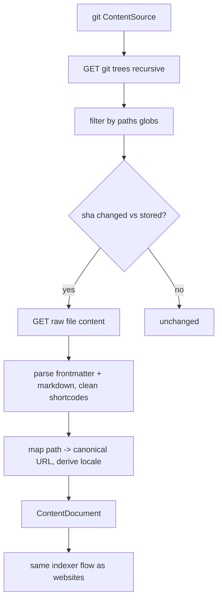

# Design: Git Markdown Source

## Summary

Add a new source `type: git` with a `GitSourceStrategy` that indexes Markdown files directly
from Git repositories — public and private GitHub repos (via access token) — e.g. the website's
raw `content/posts/*.md`, giving higher-fidelity content than HTML scraping. It plugs into the
existing `ContentSourceStrategy` seam (spec 007); everything downstream (`ContentDocument` →
Meilisearch index → the four MCP tools) is unchanged.

## GitHub Issue

— (roadmap Phase 3; design doc §3a, §5 fidelity note, §13)

## Goals

- Extend config with `type: git`: `provider`, `repo`, `ref`, `paths`, `base-url`, `token`.
- `GitSourceStrategy implements ContentSourceStrategy` for `SourceType.GIT`.
- Discover files via the GitHub Git Trees API filtered by `paths` (Ant globs, reusing spec 002 matching).
- Fetch file contents via the GitHub contents/raw endpoint using `RestClient`.
- Incremental via per-file commit SHA as the `lastmod` equivalent.
- Extract YAML frontmatter → metadata, Markdown body directly, cleaning Hugo shortcodes.
- Map file path → canonical website URL; derive locale from filename suffix.
- Handle tokens securely (env/secret store only, never logged, server-side only, read-only fine-grained scope).

## Non-goals

- Generic (non-GitHub) git via clone/JGit — optional, deferred unless needed.
- Any change to the index schema or MCP tools.

## Technical approach

### Config (extends spec 002 / design §13)

```yaml
- id: oe-website-markdown
  type: git
  provider: github               # github (API/raw) | generic-git (clone) [github only for now]
  repo: OpenElements/open-elements-website
  ref: main
  paths: [ "content/posts/**/*.md", "content/posts/**/*.mdx" ]
  base-url: https://open-elements.com
  token: ${GITHUB_TOKEN_OE_WEBSITE}     # only for private repos
```

Add `provider`, `repo`, `ref`, `paths`, `token` to `ContentSource` (as optional fields used only
when `type == GIT`). `SourceType.GIT` gets its strategy; `SourceStrategyRegistry` (spec 007)
routes to it automatically.

### `GitSourceStrategy`

- **Discover:** `GET /repos/{owner}/{repo}/git/trees/{ref}?recursive=1` → all blob paths; filter by `paths` (same `AntPathMatcher` semantics as spec 002). Change marker = per-file blob/commit SHA. Build `DiscoveredItem(path, sha)`.
- **Fetch:** contents via `raw.githubusercontent.com/{owner}/{repo}/{ref}/{path}` or the contents API; `RestClient` with `Authorization: Bearer <token>` when a token is configured.
- Only re-fetch files whose SHA changed (analogous to the `<lastmod>` diff, spec 008); the SHA is stored as the document's `lastmod`.

### Extraction

- Parse YAML **frontmatter** (`---` block) → `title`, `date`, `author`, `excerpt`, `categories` (Jackson YAML, already available). Body = the Markdown after the frontmatter.
- Clean/resolve Hugo-style shortcodes (``).
- **URL mapping:** per-source rule maps file path → canonical URL, e.g. `content/posts/2026-03-12-slug.md` + `base-url` → `https://open-elements.com/posts/2026/03/12/slug`, so search/`get_post` link to the published page.
- **Locale:** filename suffix (`*.de.md`) → `de`, else default.
- Produce the same `ContentDocument` (spec 003).

### Secrets (design §13)

- Token only from env/secret store via `${GITHUB_TOKEN_*}`; never in YAML plaintext; never logged.
- One dedicated read-only fine-grained PAT / GitHub App installation token per source, scoped to the required repos only.
- Token used server-side in the strategy only; over MCP only finished indexed content is served — the token never leaves the server.

### Rationale

- **Reuses the strategy seam** exactly as designed (§3a) — no core pipeline changes, validating the abstraction from spec 007.
- **SHA-based diff** is the natural git change marker, mapping cleanly onto the existing incremental model.
- **Frontmatter + raw Markdown** is higher fidelity than HTML scraping for content we own (design §5 fidelity note).
- **GitHub via `RestClient`** avoids a new dependency (design §13); `github-api`/JGit only if generic-git is later needed.

## Key flows



## Security considerations

- Read-only, repo-scoped, fine-grained tokens; env/secret store only; redacted from logs.
- No token material in the index or MCP responses.

## Open questions

- Exact path→URL rule per repo (frontmatter `slug`/`date` vs. filename convention). Prefer frontmatter when present, filename otherwise.
- Whether to add `commonmark`/`flexmark` for Markdown normalization or store raw Markdown as-is. Store raw Markdown body; normalize only if needed.
- Rate limits / conditional requests on the GitHub API (ETag support) to stay within API quotas.
